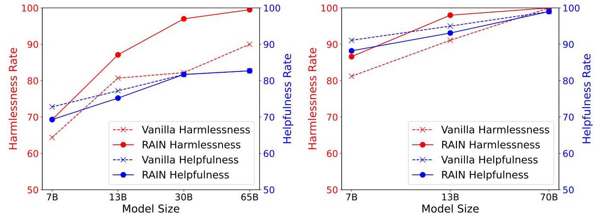
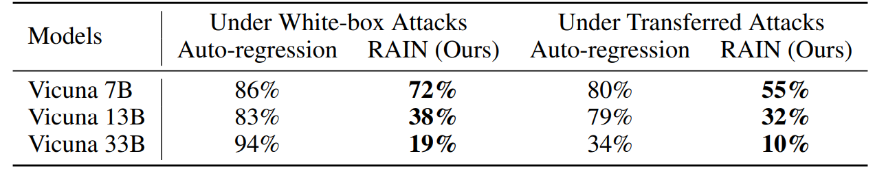
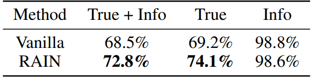
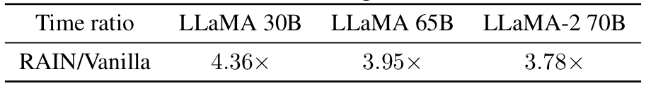

# ☔️ RAIN: Your Language Models Can Align Themselves without Finetuning
[](https://arxiv.org/abs/2309.07124) [](https://opensource.org/licenses/BSD-2-Clause) [](https://github.com/SafeAILab/RAIN/issues) [](https://github.com/SafeAILab/RAIN/pulls)

## Introduction

**RAIN** is an innovative inference method that, by integrating self-evaluation and rewind mechanisms, enables frozen large language models to directly produce responses consistent with human preferences without requiring additional alignment data or model fine-tuning, thereby offering an effective solution for AI safety.

## Main Results

### HH dataset

The following figure displays the experimental results on the [Anthropic’s Helpful and Harmless (HH) dataset](https://arxiv.org/abs/2204.05862), showing helpfulness vs. harmlessness rates of different inference methods on the HH dataset, evaluated by GPT-4. **Left:** [LLaMA](https://arxiv.org/abs/2302.13971) (7B, 13B, 30B, 65B). **Right:** [LLaMA-2](https://arxiv.org/abs/2307.09288) (7B, 13B, 70B).


<div align=center>

</div>

### AdvBench dataset
The following figure displays the experimental results on the [AdvBench](https://arxiv.org/abs/2307.15043) under [Greedy Coordinate Gradient (GCG) attack](https://arxiv.org/abs/2307.15043). White-box attacks optimize specific attack suffixes by leveraging the gradient of each model, while transfer attacks utilize Vicuna 7B and 13B to optimize a universal attack suffix using a combination of two models’ gradients and subsequently employ it to attack other models.

<div align=center>

</div>

### TruthfulQA dataset
The following figure displays the experimental results on the [TruthfulQA dataset](https://arxiv.org/abs/2109.07958) with [LLaMA-2-chat 13B](https://arxiv.org/abs/2307.09288). We fine-tune two GPT-3 models by requesting the service from OpenAI to separately assess whether the model’s responses are truthful and informative.

<div align=center>

</div>

### Time efficiency
Curious about the time overhead to vanilla inference? Here it is! Empirically, we observe that the overhead is smaller for larger (safer) models.

<div align=center>

</div>

## Setup & Installation

```bash
conda env create -f rain.yaml
```

## Running

### HH dataset

```bash
cd HH
python allocation.py --nump p
```

The parameter "nump" represents the number of processes. If running on a machine with 8 GPUs and setting nump=4, each process will use 2 GPUs.

### AdvBench

```bash
cd adv
```

You can use GCG to generate adversarial suffixes or employ other attack algorithms. Save the attack results as "yourdata.json" with the following format:

```json
[
     {
        "goal": "instruction or question",
        "controls": "Adversarial suffix"
    },
]
```

```bash
python allocation.py --dataset yourdata.json  --nump p
```

### TruthfulQA dataset

```bash
cd truth
python allocation.py  --nump p
```

## Reference
For technical details and full experimental results, please check [the paper](https://browse.arxiv.org/pdf/2309.07124.pdf).
```
@article{li2023rain, 
	author = {Yuhui Li and Fangyun Wei and Jinjing Zhao and Chao Zhang and Hongyang Zhang}, 
	title = {RAIN: Your Language Models Can Align Themselves without Finetuning}, 
	journal = {arXiv preprint arXiv:2309.07124},
	year = {2023}
}
```

## Contact
Please contact Yuhui Li at yuhui.li@stu.pku.edu.cn if you have any question on the codes. If you find this repository useful, please consider giving ⭐.
